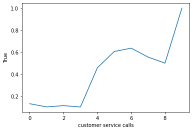
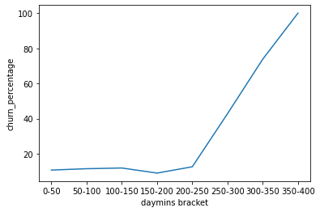
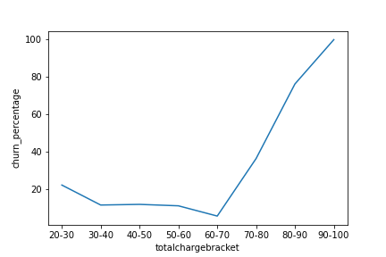
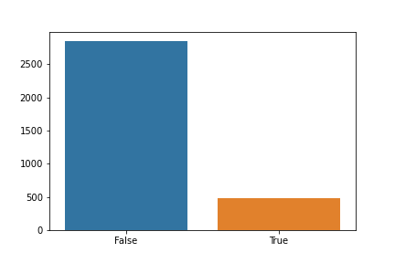
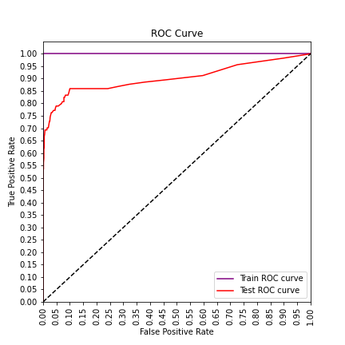

## SyriaTel Churn 
Syriatel is a communications company hoping to prevent customer churn.  They have provided me with their customer data to predict churn using classification regression.
### Feature Analysis

Day charge is the feature most responsible for churn.  Customers are clearly price sensitive.
#### Customer Service Calls

Once a customer makes more than 3 calls, churn rate increases dramatically.
#### Daytime Charge

Daytime charge is the biggest indicator of churn.  Once people speak for over 250 minutes (.17c per minute), churn rate gets continuously higher.
#### Total Charge

Once a customer spends more than $70 total on the month (regardless of time breakdown), churn takes off.
### Model

There was a 14.49% churn rate

Our Random Foeest Classifier yielded the best model.

Precision= 95%

Recall= 61%

Accuracy= 94%

F1 Score- 74%
### Recommendations
Once a customer calls more than three times, they should be offered a special promotion to keep them happy.  The 4th call is typically when churn rates become worrysome.

The biggest predictor of churn is ultimately because the service is too expensive.  Syriatel should offer an unlimited minutes pricing plan to frequent users as this will prevent them from churn and ultimately allow them to retain business.
### Next Steps
Compare pricing plans and customer churn rates with competitors.

