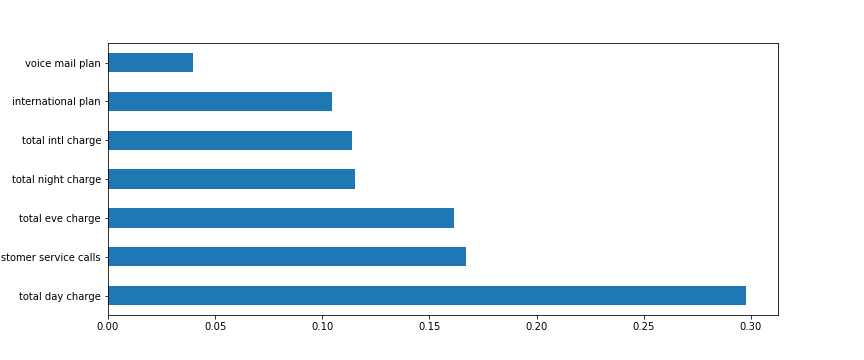
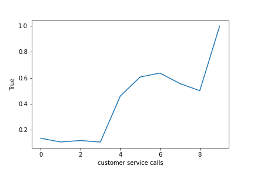
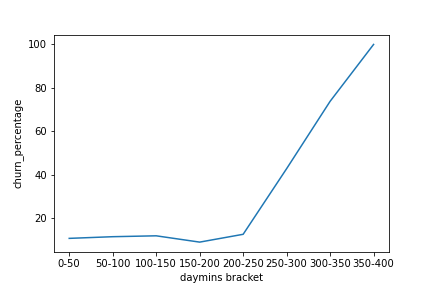

## SyriaTel Churn 
Syriatel is a communications company hoping to prevent customer churn.  They have provided me with their customer data to predict churn using classification regression.
## Business Understanding
Syriatel, a mobile network provider, is a high margin enterprise interested in reducing customer loss.  They have the ability to offer a special pricing promotion or adjust pricing plans but wish only to do so for customers they are about to lose in order to retain their business and maximize revenue.  I am tasked with building a classification model to predict which customers have the highest likihood of leaving so they can offer the promotion or pricing plan adjustment to reduce customer churn and maximize profits.

## Data Understanding
The data is a csv file from the telecom's customers.  There are over 3,300 rows of data and 21 columns such as minutes used, customer service calls placed, plans, charges, and of course churn.  I am evaluating all of the columns to see what is impacting churn so it can be predicted.  Limitations of this data are that it comes from only one company, Syriatel, and competitors data isn't used to shape our conclusions. 

## Data Preparation
There are 21 columns but not all of them are actually relevant to churn.  We are going to examine each column and measure its churn rates.  If the data is continuous it will be binned so that trends can be detected as the column's values get higher or lower.  Columns that are not relevant will be dropped from the classification model analysis.  I will build three models and seek to optimize F1 score (the harmonic mean of precision and recall), accuracy, precision, and recall.
### Feature Analysis

Day charge is the feature most responsible for churn.  Customers are clearly price sensitive.
#### Customer Service Calls

Once a customer makes more than 3 calls, churn rate increases dramatically.
#### Daytime Charge

Daytime charge is the biggest indicator of churn.  Once people speak for over 250 minutes (.17c per minute), churn rate gets continuously higher.
#### Total Charge

Once a customer spends more than $70 total on the month (regardless of time breakdown), churn takes off.
### Model

There was a 14.49% churn rate

Our Random Foeest Classifier yielded the best model.

Precision= 95%

Recall= 61%

Accuracy= 94%

F1 Score- 74%

### Evaluation

The random forrest classifier was the most effective prediction model as the F1 score, Testing Precision, and Testing Accuracy were significantly higher than other models.  There was a slight dip in recall but overall model performance was stronger.  Given that there was a high class imbalance and only 14.49% of customers churned, recall is more important that precision because identifying the highest percentage of those that churned will allow Syriatel to optimize the efficiency of their promotional offers but given the minor difference with other models, this model was still the correct choice.
### Recommendations
Once a customer calls more than three times, they should be offered a special promotion to keep them happy.  The 4th call is typically when churn rates become worrysome.

The biggest predictor of churn is ultimately because the service is too expensive.  Syriatel should offer an unlimited minutes pricing plan to frequent users as this will prevent them from churn and ultimately allow them to retain business.
### Next Steps
Compare pricing plans and customer churn rates with competitors.

